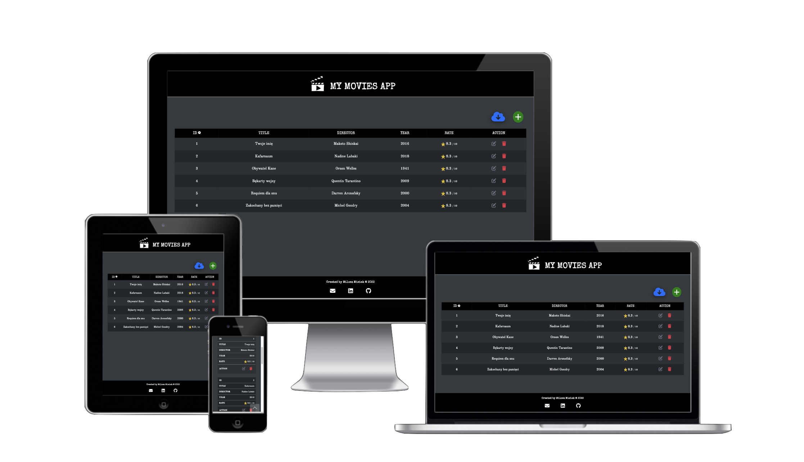
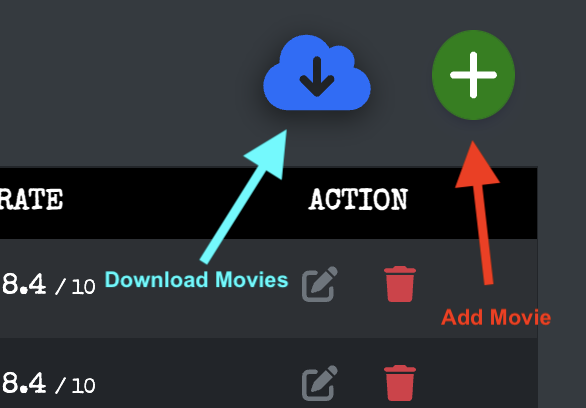
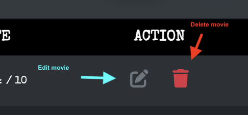
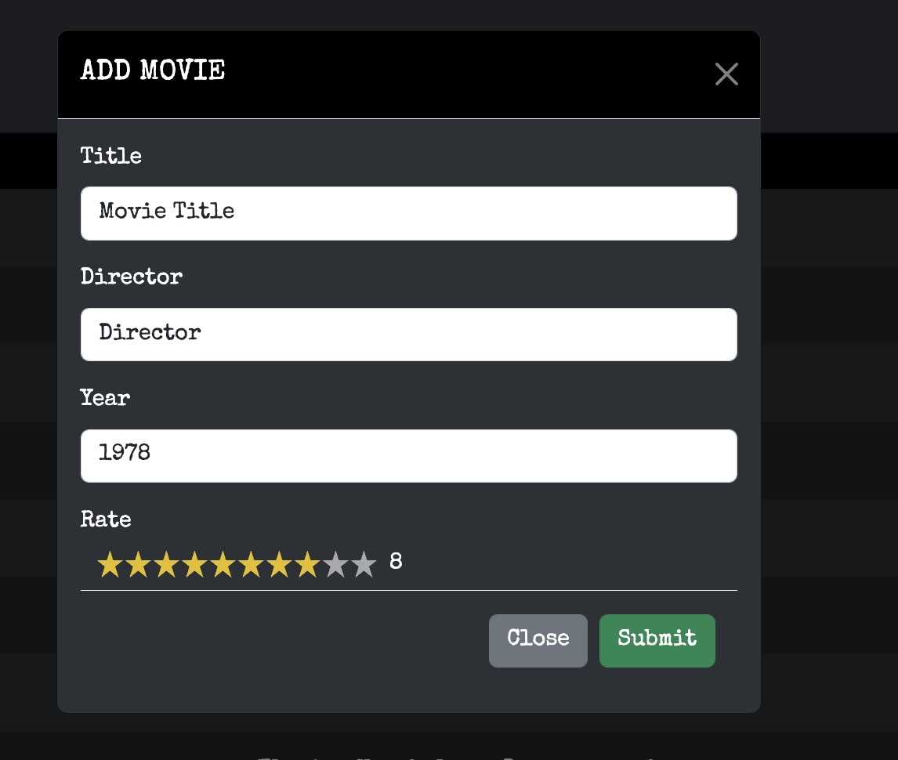
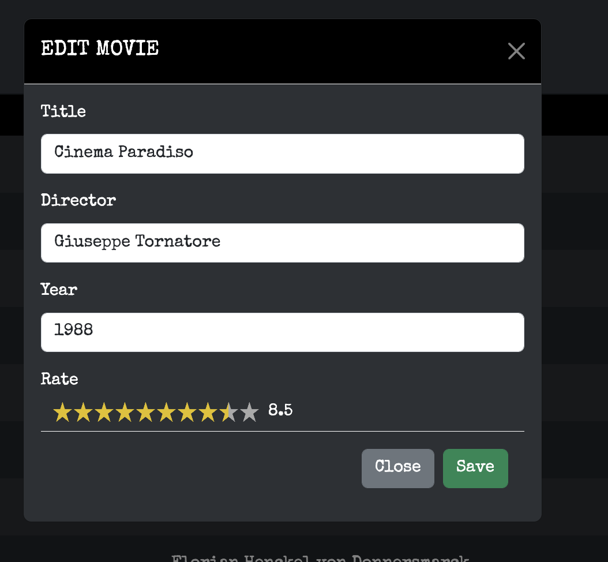
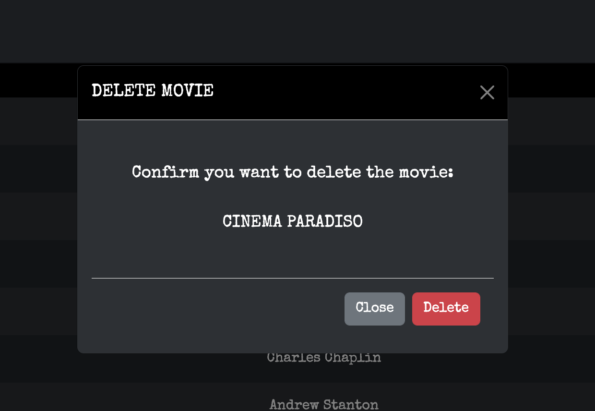
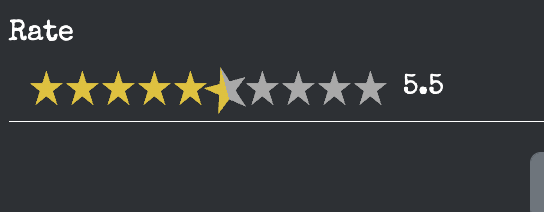
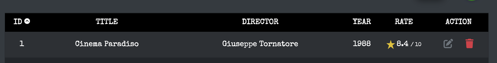
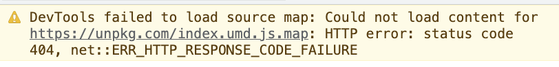

# 
 My Movies App :clapper:
<!-- omit in toc -->

##  <!-- omit in toc -->

## **Table of Contents**

- [**Table of Contents**](#table-of-contents)
- [**Overview**](#overview)
  - [Production](#production)
  - [Development](#development)
- [**Technologies Used**](#technologies-used)
- [**How to use?**](#how-to-use)
- [**Bugs**](#bugs)
  - [default-passive-events warning](#default-passive-events-warning)
- [**Credits**](#credits)
- [**Acknowledgments**](#acknowledgments)

## **Overview**

This project serves as a **Junior Software Developer** recruitment task for [Software Studio](https://www.softwarestudio.com.pl/). It is a simple web application for displaying custom movies list in tabular format. The app allows for full CRUD functionality and allows users to download movies from an external API endpoint [here](https://filmy.programdemo.pl/swagger/index.html).

The app is fully responsive and was tested on different screen sizes.

### Production

The production version can be found [here](https://enchanting-ganache-56f1cf.netlify.app/).

The production version of the web API endpoint can be found [here](https://mymovies-task.azurewebsites.net/).

The production version uses **[Azure SQL Server](https://azure.microsoft.com/en-gb/services/sql-database/campaign/)** as a database provider.

### Development

The backend repository can be found [here](https://github.com/miloszmisiek/mymovies-webapi).

The devolpment version uses **'in memory database'** for testing purpose - built-in feature of EF Core toolkit.

[Back to contents](#table-of-contents)

## **Technologies Used**

- ### Languages

  - [JS](https://www.javascript.com/): the primary language used to develop interactive components of the website.
  - [HTML](https://developer.mozilla.org/en-US/docs/Web/HTML): the markup language used to create the website.
  - [CSS](https://developer.mozilla.org/en-US/docs/Web/css): the styling language used to style the website.
  - [C#](https://learn.microsoft.com/pl-pl/dotnet/csharp/): the genral purpose language used to develope minimalistic web API.

- ### Front-End Frameworks and Libraries

  - [Vue.js](https://vuejs.org/): version 3.2 with Composition API - was used for building a user interface.
  - [Sass](https://sass-lang.com/): was used for implementing CSS preprocessor.
  - [Bootstrap](https://getbootstrap.com/): version 5.2, was used to style the app with built-in tools.

- ### Backend Frameworks and Libraries

  - [ASP.NET Core](https://learn.microsoft.com/en-us/aspnet/core/release-notes/aspnetcore-7.0?view=aspnetcore-7.0): version 7.0 - was used to scaffold the minimalistic web API.
  - [Entity Framework Core](https://learn.microsoft.com/en-us/ef/core/): was used to work with a database using .NET objects.
  - [Azure SQLServer](https://azure.microsoft.com/en-gb/services/sql-database/campaign/): was used to build SQL databse for production.
  
- ### Other tools

  - [Netlify](https://www.netlify.com/): was used to build and host the front-end.
  - [Git](https://git-scm.com/): the version control system used to manage the code.
  - [Vite](https://vitejs.dev/): was used as a frontend development building tool.
  - [GitHub](https://github.com/): used to host the website's source code.
  - [VSCode](https://code.visualstudio.com/): the IDE used to develop the website.
  - [Visual Studio for Mac](https://visualstudio.microsoft.com/vs/mac/): version 2022, this IDE was used to build the backend for the project.
  - [Fontawesome](https://fontawesome.com/): was used to implement icons with animation.
  - [Grammarly](https://www.grammarly.com/): was used to check grammar and typo errors.
  - [eslint](https://eslint.org/): ESLint statically analyzes code to quickly find problems. Was used to check any linting errors and warning in the code.

- ### NPM packages & components

  - [star-rating](https://www.npmjs.com/package/vue-star-rating): was used to implement star rating component.
  - [default-passive-event](https://github.com/zzarcon/default-passive-events): was used to add passive mode to event listeners.

[Back to contents](#table-of-contents)

## **How to use?**

Open the app by navigating to **[this](https://enchanting-ganache-56f1cf.netlify.app/)** page.

1. To add a movie click on the green button above the table.
2. To fetch movies click on the blue cloud button above the table.

3. To edit the movie click on the grey button next to the movie.
4. To delete a movie click on the red button next to the movie.

5. To submit the form fill in the data and click submit.
6. You can close the modal by clicking the close, 'X' button or clicking outside the modal.

7. To change movie data fill in the desired filled and click save.
8. You can close the modal by clicking the close button, the 'X' button or clicking outside the modal.

9. To delete the movie simply confirm your choice by clicking delete.
10. You can close the modal by clicking the close button, the 'X' button or clicking outside the modal.

11. Star Rating component allows to increment by **.5** - this can be changed, but for the designer that is the best scale.
12. To save the rate simply hover over the star and click on it.

13. Users can sort the data in ascending or descending order by clicking on a table header. The arrow indicates the sorting direction and which heading is used for sorting.

[Back to contents](#table-of-contents)

## **Bugs**

### default-passive-events warning

During the development process the warning "Added non-passive event listener to a scroll-blocking <some> event. Consider marking event handler as 'passive' to make the page more responsive." was present every time the modal was opened or the page reloaded. It is caused by using prevent default and not making the listener passive. To solve it the package was installed, but even though the errors regarding the non-passive event listener are gone, the loading warning for the package is present.

It is left because the previous warnings are gone, so the final result is achieved.

## **Credits**

1. All fonts come from [Google Fonts](https://fonts.google.com/).
2. The movie clapper logo comes from [cleanpng.com](https://www.cleanpng.com/png-clapperboard-filmmaking-celebrity-production-compa-6341315/)

[Back to contents](#table-of-contents)

## **Acknowledgments**

1. **[Software Studio](https://www.softwarestudio.com.pl/) Recruitment Team** - for giving me a chance to improve my skills by doing this task - regardless of the outcome it was a great experience for self-development. Thank you!
2. As always big thanks to [Stack Overflow](https://stackoverflow.com/) community for the best bug-solving space ever created!

[Back to contents](#table-of-contents)

---
**
Created by Milosz Misiek
**

    

